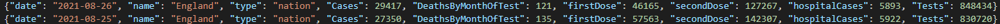

# Project description

## 1.Creating AWS Account

- Create account at https://aws.amazon.com/console/
- Choose Business
- Authorize your account using the billing card
- Verify account by sms or call
- Choose Basic Plan

## 2.Configuration

- Install Microsoft Visual Studio Code (VSC)
- In VSC install Python Extension 
- Download python for Desktop https://www.python.org/downloads/release/python-396/
- Install pip to install additional libraries which are not in Python https://pip.pypa.io/en/stable/installation/
- Install Node.js to configure Serverless https://nodejs.org/en/download/

## 3.Creating IAM User in AWS
- Users > Add Users
- Choose your Username
- Select Access type : Programmatic access
- Choose Attach existing policies directly, select Administrator Access
- Users > Security credentials > Create access key
- Now you generated Access key ID and Secret Access key, which are needed to manage resources
- Don't publish your Secret Access key


## 4.Serverless
- Install Serverless through npm
```
npm install -g serverless
```
- Install serverless plugins
```
serverless plugin install -n serverless-python-requirements
serverless plugin install -n serverless-wsgi
```
## 5.Deploy simple code
- Create New Catalog and open it in VSC
```
$ cd Your_APP_Catalog
```
- Create New File app.py and paste code :
```
# app.py

from flask import Flask
app = Flask(__name__)

@app.route("/")
def hello():
```
- Create New File serverless.yml and paste code (this is a Serverless configuration file) :
```
# serverless.yml

service: serverless-flask

plugins:
  - serverless-python-requirements
  - serverless-wsgi

custom:
  wsgi:
    app: app.app
    packRequirements: false
  pythonRequirements:
    dockerizePip: non-linux

provider:
  name: aws
  runtime: python3.6
  stage: dev
  region: us-east-1

functions:
  app:
    handler: wsgi.handler
    events:
      - http: ANY /
      - http: 'ANY /{proxy+}'
```
- Create Virtual Environment (venv) and activate it by "activate" file in venv directory
```
$ virtualenv venv --python=python3
$ ./venv/scripts/activate
```
- In venv install requirements used in your code 
```
(venv) $ pip install flask
```
- Freeze your pip requirements
```
$ pip freeze | Out-File -Encoding UTF8 requirements.txt
```
Now you created the requirements.txt file, which is needed to deploy your code
- Deploy your resources to AWS by using the command
```
$ serverless deploy
```
- If Serverless deploy requires Docker, then install it and enable. 
- After deploying, click the generated Endpoint and should be displayed text.

```
Hello World!
```
- You can see your logs of deployment in AWS CloudWatch > Log groups 
More information about configurating Serverless:
https://wb.serverless.com/blog/flask-python-rest-api-serverless-lambda-dynamodb
More information about Flask library:
https://flask.palletsprojects.com/en/2.0.x/
## 6.Deployed Resources
- After clicking a generated endpoint from deployment, resources are created IN :
    - AWS S3, there is a Serverless Deployment Bucket (Deployment storage)
    
    - AWS Lambda select your deployed Application (app.py)
    - You can see Resources that you have deployed
    
    - AWS Lambda Functions, there is a overview of your function, Your code (Lambda) triggers API to collect the data (Now you triggered "Hello World!")
    
## 7.Upgrading your code
- Choose your endpoint request API
    - For example I used the endpoint, from this API documentation https://coronavirus.data.gov.uk/details/developers-guide/main-api
    ```
    https://api.coronavirus.data.gov.uk/v1/data
    ```
- Create a request, more information about request https://docs.python-requests.org/en/latest/user/quickstart/
```
data = request.get(ENDPOINT, params=api_params, timeout=10)
```
- Install the requirements used in your code (imports)
```
$ pip install requests
```
- Freeze the requirements
```
$ pip freeze | Out-File -Encoding UTF8 requirements.txt
```

- Create your request Parameters to Specify your data (Params should be located in API documentation)
- Example of Parameters :
```
filters = [
    f"areaType={ areaType }",
    #f"areaName={ areaName }",
    #f"date={ date }",
    #f"areaCode={ areaCode }"
]

structure = {

    "date": "date",
    "name": "areaName",
    "type": "areaType",
    "Cases": "newCasesByPublishDate",
    #"cumulativeCases": "cumCasesByPublishDate",
    "DeathsByMonthOfTest": "newDeaths28DaysByPublishDate",
    "firstDose" : "newPeopleVaccinatedFirstDoseByPublishDate",
    "secondDose" : "newPeopleVaccinatedSecondDoseByPublishDate",
    "hospitalCases": "hospitalCases",
    "Tests": "newTestsByPublishDate",
    #"femaleCases":"femaleCases",
    #"completeVaccinated" : "newPeopleVaccinatedCompleteByPublishDate",
    #"maleCases":"maleCases"
}

api_params = {
    "filters": str.join(";", filters),
    "structure": json.dumps(structure, separators=(",", ":"))
}
```
- Structure - there is a structure of your JSON data 

- Filters - filter the structure to specify your data
    For example use filter:
    ```
    date='2021-06-07'
    f"date={ date }",
    ```
    And Following JSON will be only from specified date:
    
- api_params - Parse the data into json
- Add the following lines to your end of your code to run your project locally
```
if __name__=="__main__":
    app.run(debug=True)
```
- Click the Green Arrow in Upper Right Corner in VSC (Run Python file in Terminal),

- CTRL+Click the generated IP and this IP will navigate to your website and display your return code

- You don't need to deploy your function to see your results
## 8.Save your data to S3 bucket
- Create new bucket, where data will be stored
- Install requirements used in your code (imports)
```
$ pip install boto3
```
- Freeze requirements
```
$ pip freeze | Out-File -Encoding UTF8 requirements.txt
```
- Create the S3 Client and Environment for S3 Bucket
```
s3_client = boto3.client(service_name='s3')
S3_BUCKET = os.getenv('S3_BUCKET')
```
- Add the following line to your get_data code (This line pushes your code to your S3 created bucket)
    - Parameters:
        - Bucket is the location of your created bucket
        - Body is your Data generated from API
        - Key creates file, when your data (Body) is stored
```
s3client=s3_client.put_object(Bucket=S3_BUCKET,Key='Data/data.json',Body=json_string_encoded)
```
- Update your serverless.yml below "provider" to get the permission access to put your data file to S3 Bucket

```
  environment:
    S3_BUCKET: s3buckecior 
  iamRoleStatements:
    - Effect: Allow
      Action:
        - s3:*
      Resource: ["arn:aws:s3:::${self:provider.environment.S3_BUCKET}/*"]
```
- environment: S3_BUCKET is your created manually bucket name
- iamRoleStatements: gets the permission to put file in S3 Bucket
- Now use the command in terminal and click the generated endpoint, then your data should be stored in bucket
```
serverless deploy
```

- More information about boto3 library :  https://boto3.amazonaws.com/v1/documentation/api/latest/index.html
## 9. Add tables to database from generated S3 data file using AWS Glue Crawler
- AWS Glue > Crawlers
- Add Crawler
- Choose your name
- Choose Data stores and Crawl all folders

- Choose your S3 path, list your created S3 Bucket, and select Data folder

- In Add another data store Choose No
- Choose an existing IAM role and select 
```
AWSGlueServiceRole-GlueRole
```
- In Create a schedule for this crawler choose frequency:  run on demand
- Configure the crawler's output

- Review all steps click Finish
- Run created Crawler
- After finishing Run Crawler, go to Tables and click generated Table
- There are the details of created table

- Run Crawler, when you change the "structure" in your code
## 10. SQL Queries in Athena
- Create the "Queries" folder in your Bucket
- Athena > Edit the Settings

- Choose the database when the table was created
- In Tables there are described columns
- Run Query Select * from data and the query result should be:

## 11. Connect Tableau using Athena
- Create account at Tableau and Tableau Public
- Download Tableau
- Activate 14 day trial
- Login to Tableau
- Choose connect the server : Amazon Athena
- Configure the connection
    - Server, set the region u have in AWS
    - Port is 443
    - S3 Staging Directory, sql queries will be saved in this location
    - Access Key ID and Secret Access Key generated earlier from IAM User Security Credentials and paste them

- After that you should have a display like this:

- You successfully connected Amazon Athena to Tableau
## 12. Create and Publish raport
- Create a story raport from this data,
- When you end the raport select the story
- Select server at the top > Tableau Public > Save to Tableau Public
- Save your data source to your system, the file looks like:

- Save to Tableau Public again
- Tableau generates the link of your raport.

# Used Resources in project

## Serverless framework
Serverless computing is a cloud computing execution model in which the cloud provider allocates machine resources on demand, taking care of the servers on behalf of their customers. Serverless computing does not hold resources in volatile memory; computing is rather done in short bursts with the results persisted to storage.
Serverless use npm : npm is the world's largest software registry. Open source developers from every continent use npm to share and borrow packages, and many organizations use npm to manage private development as well.
## API
API is the acronym for Application Programming Interface, which is a software intermediary that allows two applications to talk to each other. Each time you use an app like Facebook, send an instant message, or check the weather on your phone, you’re using an API.
## AWS Glue
AWS Glue is a serverless data integration service that makes it easy to discover, prepare, and combine data for analytics, machine learning, and application development.
## AWS S3
Amazon Simple Storage Service (Amazon S3) is an object storage service that offers industry-leading scalability, data availability, security, and performance.
## AWS Lambda
Lambda is a compute service that lets you run code without provisioning or managing servers. Lambda runs your code on a high-availability compute infrastructure and performs all of the administration of the compute resources, including server and operating system maintenance, capacity provisioning and automatic scaling, code monitoring and logging.
## AWS Athena
Amazon Athena is an interactive query service that makes it easy to analyze data in Amazon S3 using standard SQL.
## AWS IAM
AWS Identity and Access Management (IAM) enables you to manage access to AWS services and resources securely. Using IAM, you can create and manage AWS users and groups, and use permissions to allow and deny their access to AWS resources. IAM is a feature of your AWS account offered at no additional charge.
## Tableau 
Tableau is a visual analytics platform transforming the way we use data to solve problems—empowering people and organizations to make the most of their data.
## AWS Cloudwatch
Amazon CloudWatch is a monitoring and observability service built for DevOps engineers, developers, site reliability engineers (SREs), and IT managers. CloudWatch provides you with data and actionable insights to monitor your applications, respond to system-wide performance changes, optimize resource utilization, and get a unified view of operational health.
## Amazon VPC
Amazon Virtual Private Cloud (Amazon VPC) enables you to launch AWS resources into a virtual network that you've defined. This virtual network closely resembles a traditional network that you'd operate in your own data center, with the benefits of using the scalable infrastructure of AWS.